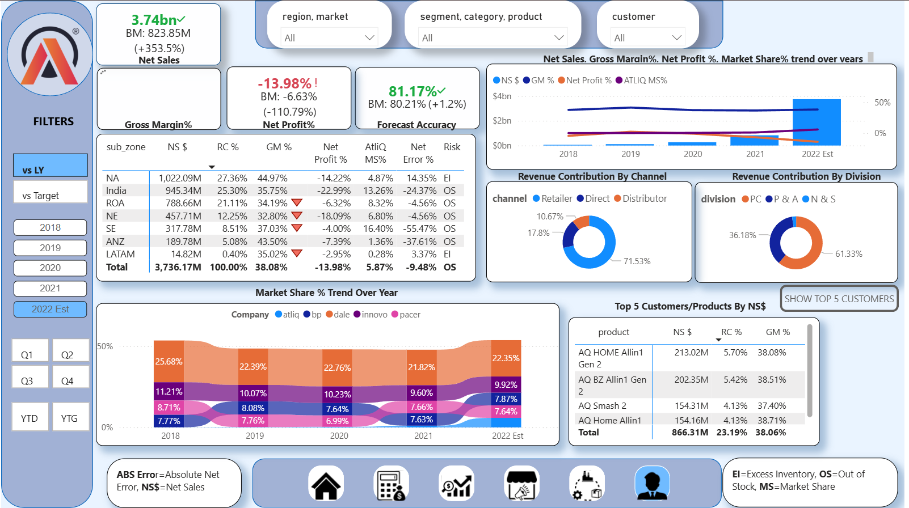
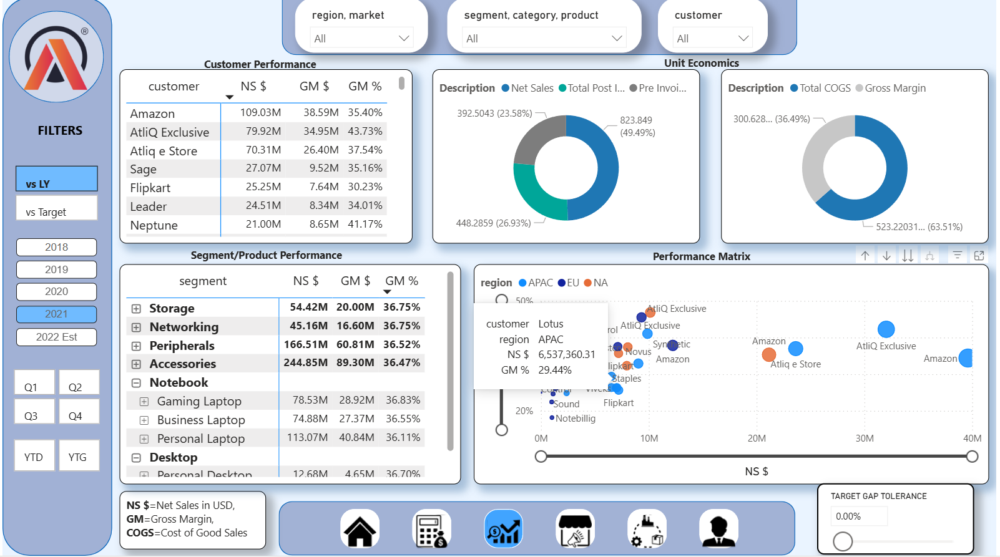

# 📊 BUSINESS INSIGHTS 360 (Power BI)  

## 📌 Table of Contents  
- [Project Overview](#project-overview)  
- [Tasks Performed](#tasks-performed)  
- [Key Insights & Recommendations](#key-insights--recommendations)  
- [Dashboards Preview](#dashboards-preview)  
- [Tools & Technologies](#tools--technologies)  
- [Skills Demonstrated](#skills-demonstrated)  
- [Conclusion](#conclusion)  
- [Explore More](#explore-more)  

---

## Project Overview  
This project is a **Power BI case study** for **AtliQ Hardware**, a multinational company selling **computers and accessories** through channels like **Amazon, Flipkart, Croma, and its **own stores/e-store**.  

AtliQ Hardware faced challenges in international markets due to intuition-driven decisions. While the competitors are leveraging data-driven decision to make profit. To stay competitive, AtliQ has decided to take data-driven decision approach. The goal of this project was to build a **unified reporting solution in Power BI** across **Finance, Sales, Marketing, and Supply Chain** to empower stakeholders with **data-driven insights**.  

The model integrates data from **SQL + Excel**, with over **1.5M+ records**, and uses a **custom fiscal year (Sep–Aug)** for accurate reporting.  

---

## Tasks Performed  
### 🔹 1. ETL & Data Cleaning (Power Query)  
- Connected to multiple data sources including **SQL Databases** and **Excel Workbooks**.  
- Removed duplicates, handled null values, standardized column names, and ensured data consistency.  
- Created calculated columns for business logic (e.g., fiscal year alignment, category grouping).  
- Ensured **data quality checks** by validating numbers against benchmark/reference values.  

### 🔹 2. Data Modeling & Relationship Building  
- Designed a **star schema** with **15+ tables** (fact & dimension).  
- Built relationships between sales, customers, products, regions, and targets.  
- Created a **custom `Dim_Date` table** with fiscal year mapping (Sep–Aug) and defined **Q1–Q4** periods for reporting.  
- Ensured proper **filter propagation** across dimensions for accurate reporting.  

### 🔹 3. KPI Development (DAX Measures)  
- Built **Net Sales, Gross Margin (GM), GM%, P&L Statement** using advanced DAX functions.  
- Implemented **Forecast Accuracy** to compare actuals vs predictions.  
- Created **variance measures** to track performance vs targets.  
- Designed **Target Tolerance KPIs** to highlight customers with high GM% variance for Sales team prioritization.  

### 🔹 4. Dashboard Design & Reporting  
- Developed **Sales, Finance, Marketing, Supply Chain** dashboards.  
- Created an **Executive Dashboard** – consolidated view of all critical KPIs for top-level decision making.  
- Added **tooltips** to show customer trends and insights on hover.  
- Built **drill-through & drill-down features** (e.g., from Region → Country → Customer).  
- Applied conditional formatting and business-focused visuals to make reports intuitive.  

### 🔹 5. Performance Optimization  
- Used **DAX Studio** to analyze query performance.  
- Optimized DAX measures (e.g., replacing row context with filter context where applicable).  
- Reduced dashboard refresh time for smoother user experience.  

### 🔹 6. User Adoption 
- Simplified navigation with bookmarks and buttons.  
- Added clear instructions and labels to improve accessibility for non-technical users.  
- Created a **User Guide** to explain dashboard usage.  
 

---

## Key Insights & Recommendations  
- **Net Sales reached $823.85M in FY2021** → a **207% increase vs benchmark**.  
  ✅ Recommendation: Focus on sustaining this momentum by doubling down on high-performing regions & channels.  

- **Net Profit % dropped to -6.63%** → high Marketing expenses need **cost optimization**.  
  ✅ Recommendation: Marketing team should reassess campaigns, cut low-ROI spends, and redirect budget toward digital channels with better returns.  

- **LATAM region grew by ~58%** → despite small base ($3.16M), shows strong **future potential**.  
  ✅ Recommendation: Increase investment in LATAM through partnerships, targeted promotions, and expanding distribution channels.  

- **Absolute Forecast Error spiked in FY2021** → indicating high fluctuations between under-forecasting & over-forecasting.  
  ✅ Recommendation: Improve demand forecasting models by integrating historical sales + external factors (seasonality, promotions, competitor activity).  

- **AtliQ reached Top 5 in overall market share (5.8%)**, marking a major competitive milestone.  
  ✅ Recommendation: Focus on retaining top customers and strengthening supply chain to further climb the market ladder.  

- **~70% of revenue is generated through retailers** like Amazon, Flipkart, Vivek, etc., emphasizing the importance of channel strategy.  
  ✅ Recommendation: Diversify channels by boosting own e-store presence to reduce over-dependence on external retailers.  
  

---

## Dashboards Preview  

### Executive Dashboard  
  
*Built an executive dashboard to track revenue, profit, forecast accuracy, market share & top customers for strategic decision-making.*  

### Sales Dashboard  
  
*Designed an interactive sales dashboard to monitor revenue, margins, unit economics & customer-product performance across regions.*  

👉 [Try Live Interactive Dashboard](https://app.powerbi.com/view?r=eyJrIjoiZTFiZjI5ODAtNzNkZi00YTFjLWE3MzctN2Q4YTQyMjY5OGNmIiwidCI6ImM2ZTU0OWIzLTVmNDUtNDAzMi1hYWU5LWQ0MjQ0ZGM1YjJjNCJ9&embedImagePlaceholder=true&pageName=55b372ed61093223a835)  

---

## Tools & Technologies  
- **Power BI** (Power Query, DAX, Data Modeling, Dashboards)  
- **SQL + Excel** (Data Sources)  
- **DAX Studio** (Performance Optimization)  

---

## Skills Demonstrated  
- ETL & Data Cleaning with Power Query  
- Data Modeling & Relationship Building  
- KPI Development with DAX  
- Dashboard Storytelling & Business Reporting  
- Performance Tuning & User Adoption  

---

## Conclusion  
This project demonstrates how **Power BI can transform raw data into actionable business insights**, enabling companies like AtliQ Hardware to:  
- Identify cost-cutting opportunities  
- Discover new market growth potential  
- Provide executives with a **single source of truth** for decision-making  

---

## Explore More  
💡 “If you’d like to interact with the live Power BI dashboard or explore my other projects, check out my portfolio 👉 [Portfolio](https://codebasics.io/portfolio/Mohammad-Navaman-Jamadar)
